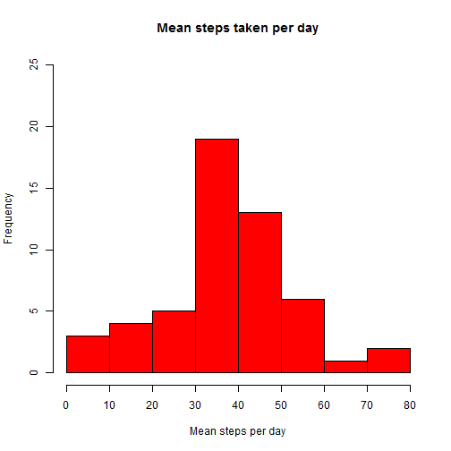
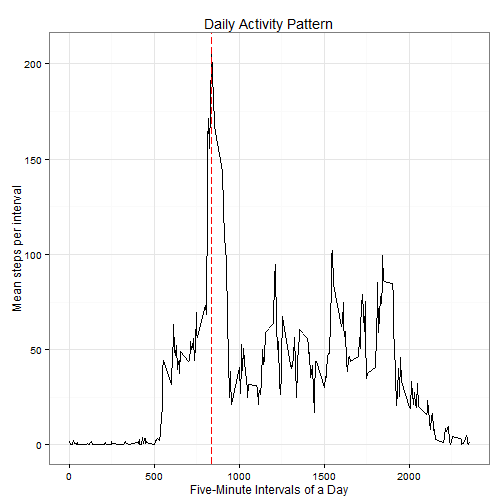
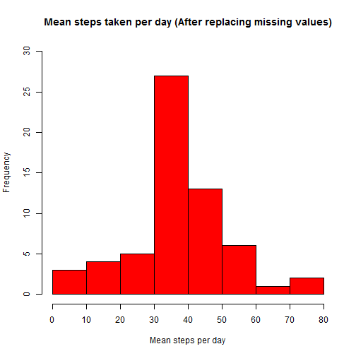
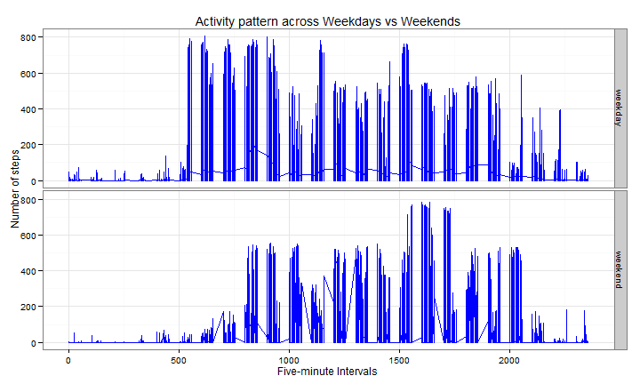

### Loading and preprocessing the data

```r
rawdata <- read.csv("activity.csv")
```
### Finding mean of total steps taken per day by aggregating the dataset


```r
dailysteps <- aggregate(rawdata$steps,list(date=rawdata$date),mean)
stepsmean <- mean(dailysteps$x,na.rm=TRUE)
stepsmedian <- median(dailysteps$x,na.rm=TRUE)
hist(dailysteps$x,xlab="Mean steps per day",ylim=c(0,25),col = "red",
     main="Mean steps taken per day",xaxt="n")
     axis(1,at=seq(0,80,10),labels=seq(0,80,10))
```

 

### Initial results
  - Mean of total steps taken per day = **37.38**
  - Median of the total steps taken per day = **37.38**

### Activity Pattern
 


```r
# Building dataset with mean steps taken for each interval
intsteps <- aggregate(rawdata$steps,list(interval=rawdata$interval),
                      mean,na.rm=TRUE)
colnames(intsteps) <- c("interval","intMean")
maxint <- intsteps$interval[which.max(intsteps$intMean)]
library(ggplot2)
actplot <- qplot(interval,intMean,data=intsteps,main="Daily Activity Pattern",
                 geom="line",ylab="Mean steps per interval", 
                 xlab = "Five-Minute Intervals of a Day")+
                 geom_vline(col="red",xintercept=maxint,linetype="longdash")
actplot + theme_bw()
```

 

 The activity pattern for each interval can be summarized into a single dataset
 by using the function *aggregate()*. The maximum mean of
 **206.17** occurs for the interval **835.**
 The actual time interval would be 1:50 PM to 1:55 PM.

### Imputing missing values
 It is also important to note the fact that the no. of steps to be replaced have to be integer. Hence
  *ceiling* function is applied to the mean before replacing.
  


```r
# Replacing NA's with corresponding mean from intsteps data  
natotal <- sum(is.na(rawdata))
newdata <- merge(rawdata,intsteps,by="interval")
    for(i in 1:nrow(newdata)){
          if(is.na(newdata$steps[i]) == TRUE){
              newdata$steps[i] <- ceiling(newdata$intMean[i])
  }
}
newdata <- newdata[order(newdata$date),]
finaldata <- subset(newdata,select=c("date","interval","steps"))
write.table(finaldata,file="finaltable.csv")

# Dailysteps analysis for the updated data set

dailysteps2 <- aggregate(finaldata$steps,list(date=finaldata$date),mean)
stepsmean2 <- mean(dailysteps2$x)
stepsmedian2 <- median(dailysteps2$x)
hist(dailysteps2$x,xlab="Mean steps per day",ylim=c(0,30),col = "red",
     main="Mean steps taken per day (After replacing missing values)",xaxt="n")
axis(1,at=seq(0,80,10),labels=seq(0,80,10))
```

 

### Results after Imputing : 
  - Total row with missing values in raw dataset = **2304**
  - Mean steps taken per day = **37.45**
  - Median of steps taken per day = **37.88**
  - A new dataset, **finaldata** is created by filling the missing values.
  - The results did not change significantly by imputing the missing values
    since they were replaced by the mean values computed previously.
 
### Effect of weekends on personal activity

```r
# Converting factor variable date to date clase
finaldata$date <- as.Date(finaldata$date)
weekend <- c("Saturday","Sunday")
test <- weekdays(finaldata$date) %in% weekend
# Creating a new factor variable *"daytype"*
finaldata$daytype <- factor(test,labels=c("weekday","weekend"))
# Aggregating the data with respect to the daytype variable
daytypeMean <- aggregate(finaldata$steps,list(daytype=finaldata$daytype),mean)
par(mfrow=c(2,1))
# Plotting the activity in panels
dayplot <- ggplot(finaldata,aes(interval,steps))+
           labs(title="Activity pattern across Weekdays vs Weekends")+
           geom_line(color="blue")+facet_grid(daytype~.)+theme_bw()+
            ylab("Number of steps")+
            xlab("Five-minute Intervals")
print(dayplot)
```

 
